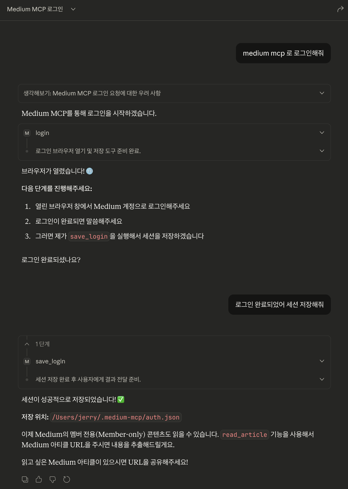

# Medium MCP Server

Medium 블로그 글을 읽어오는 Model Context Protocol (MCP) 서버입니다.

AI 어시스턴트(Claude, ChatGPT 등)가 Medium 글의 내용을 직접 읽고 분석할 수 있도록 해줍니다.

## Features

- Medium 글 URL에서 콘텐츠 추출
- Playwright 헤드리스 브라우저로 동적 콘텐츠 처리
- Mozilla Readability로 본문만 깔끔하게 추출
- Markdown 형식으로 변환하여 반환
- **로그인 지원**: Medium 멤버십 전용 콘텐츠 접근 가능

## 지원 도메인

- `medium.com`
- `*.medium.com` (사용자 서브도메인)
- `towardsdatascience.com`
- `betterprogramming.pub`
- `levelup.gitconnected.com`

## 설치

### 1. 저장소 클론

```bash
git clone https://github.com/yoyojyv/medium-mcp-server.git
cd medium-mcp-server
```

### 2. 의존성 설치

```bash
npm install
```

### 3. Playwright 브라우저 설치

```bash
npx playwright install chromium
```

### 4. 빌드

```bash
npm run build
```

## 사용 방법

### Claude Desktop에서 사용

`claude_desktop_config.json` 파일에 다음을 추가합니다:

**macOS**: `~/Library/Application Support/Claude/claude_desktop_config.json`
**Windows**: `%APPDATA%/Claude/claude_desktop_config.json`

```json
{
  "mcpServers": {
    "medium": {
      "command": "node",
      "args": ["/절대/경로/medium-mcp-server/dist/index.js"]
    }
  }
}
```

### Cursor에서 사용

Cursor 설정의 MCP 섹션에 추가:

```json
{
  "mcpServers": {
    "medium": {
      "command": "node",
      "args": ["/절대/경로/medium-mcp-server/dist/index.js"]
    }
  }
}
```

### 직접 테스트

```bash
# tools 목록 확인
echo '{"jsonrpc":"2.0","method":"tools/list","id":1}' | node dist/index.js
```

## 제공 Tools

### `read_article`

Medium 글 URL에서 콘텐츠를 추출합니다.

**입력:**
| 파라미터 | 타입 | 필수 | 설명 |
|---------|------|------|------|
| url | string | O | Medium 글 URL |

**출력:**
```json
{
  "title": "글 제목",
  "author": "작성자",
  "publishedAt": "2025-12-15T00:00:00Z",
  "content": "# 글 제목\n\n본문 내용 (Markdown)...",
  "excerpt": "글 요약",
  "url": "https://medium.com/..."
}
```

**사용 예시 (Claude에서):**

```
이 Medium 글을 읽고 요약해줘: https://medium.com/@username/article-title-123abc
```

---

### `login`

Medium 로그인을 위한 브라우저 창을 엽니다. 멤버십 전용 콘텐츠에 접근하려면 로그인이 필요합니다.

**사용 예시:**
```
Medium에 로그인해줘
```

> 브라우저 창이 열리면 직접 로그인을 완료하세요.

---

### `save_login`

로그인 완료 후 세션을 저장합니다. `login` 실행 후 사용합니다.

**사용 예시:**
```
로그인 세션을 저장해줘
```

> 세션은 `~/.medium-mcp/auth.json`에 저장됩니다.

---

### `login_status`

현재 로그인 상태를 확인합니다.

**출력:**
```json
{
  "loggedIn": true,
  "storagePath": "/Users/username/.medium-mcp/auth.json",
  "message": "You are logged in. Member-only content should be accessible."
}
```

---

### `logout`

저장된 로그인 세션을 삭제합니다.

**사용 예시:**
```
Medium에서 로그아웃해줘
```

---

## 멤버십 콘텐츠 접근 방법

Medium 멤버십 전용 글을 읽으려면:

1. **로그인 시작**: "Medium에 로그인해줘" 라고 요청
2. **브라우저에서 로그인**: 열린 브라우저 창에서 Medium 계정으로 로그인
3. **세션 저장**: "로그인 세션을 저장해줘" 라고 요청
4. **글 읽기**: 이제 멤버십 전용 글도 읽을 수 있습니다

### Claude Desktop 사용 예시



```
# 예시 대화
사용자: Medium에 로그인해줘
Claude: 브라우저가 열렸습니다. 로그인을 완료한 후 알려주세요.

사용자: 로그인 완료했어. 세션 저장해줘
Claude: 로그인 세션이 저장되었습니다.

사용자: 이 글 읽어줘: https://medium.com/membership-only-article
Claude: (멤버십 전용 글 내용 표시)
```

## 개발

### 개발 모드 실행

```bash
npm run dev
```

### 빌드

```bash
npm run build
```

### 프로젝트 구조

```
src/
├── index.ts              # 진입점
├── server.ts             # MCP 서버 설정
├── tools/
│   ├── read-article.ts   # read_article Tool
│   └── auth.ts           # 로그인 관련 Tools
├── services/
│   └── article-extractor.ts  # Playwright + Readability
└── types/
    └── article.ts        # 타입 정의
```

## 기술 스택

- **TypeScript** - 타입 안전성
- **@modelcontextprotocol/sdk** - MCP 서버 구현
- **Playwright** - 헤드리스 브라우저
- **@mozilla/readability** - 콘텐츠 추출
- **Turndown** - HTML → Markdown 변환
- **Zod** - 스키마 검증

## 제한사항

- Paywall 콘텐츠는 로그인 후 접근 가능
- 과도한 요청 시 Rate limiting 가능성
- Playwright 브라우저 설치 필요 (~300MB)

## 라이선스

MIT
